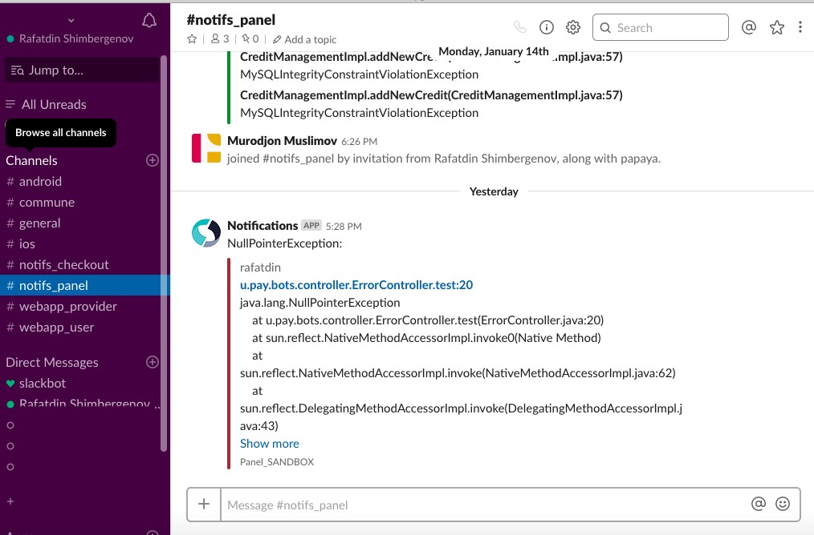
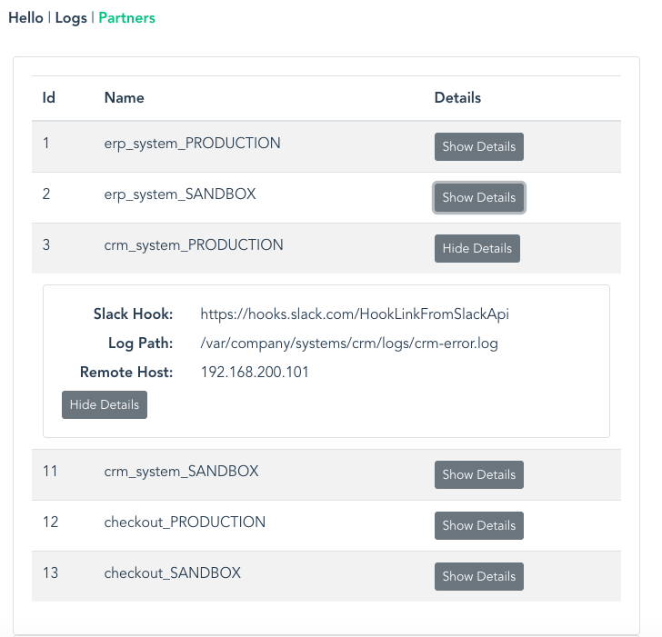

# notifier

[](https://travis-ci.org/jonashackt/spring-boot-vuejs)
[](https://github.com/jonashackt/spring-boot-vuejs/blob/master/LICENSE)
[](https://github.com/spring-projects/spring-boot)
[](https://nodejs.org/en/)
[](https://vuejs.org/)
[](https://cli.vuejs.org/)
[](https://webpack.js.org/)
[](https://github.com/axios/axios)

> Although this project is developed for my current company's 
specific needs, you can use as it is right now for your own needs 
or simply look up what is useful for you. So what's under the hood?

Shortly, **centralized** API which sends messages to project's Slack channel and 
tailing that project's log file(s). 

## Table of Contents  
* [What was the need](what-was-the-need)
* [First App run](first-app-run)
* [Faster feedback with webpack-dev-server](#faster-feedback-with-webpack-dev-server)


## What was the need?

 In my current workplace we have many projects developed for different purposes. 
 They are deployed in different servers (distributed by their purpose) and as the
 company is growing it may become hard to monitor projects. Moreover in case if something
 goes wrong in production (bug, attack, integrated system is down, etc.) developers should be
 instantly notified and identify what went wrong.
 

## What is the use?
 
 In every of our project we have global exception handler, which calls **notifier**'s API for message sending. 
 So whenever there's an unexpected behaviour developers are notified in project's slack channel. 
 The message includes ___(exception) message___, ___username___ (if available), ___class name___ 
 where the exception occured, ___stack trace___ and finally ___project/module name___.
 The class name is also a link, which leads to the server where the notifier app is deployed.
 Once developer is on the page, he/she can instantly tail the project's log file to see what exactly has happened. 

 
 ##### What does that give you?
 Well, it enables developers to instantly react to the unexpected behaviour within your app, cause usually it 
 takes while when user sees some error message -> contacts your company -> explains what happened (if he ever does it) 
 and developers get to know when and what the hell happened. 
 
 Slack messages notify everybody involved in project that _something_ went wrong, and centralized log tailing - 
 simply saves time to identify what exactly is that _something_ to recreate and prevent from happening again (at least in my case :)).

 
  


## First App run

Inside the root directory, do a: 

```
mvn clean install
```

Run our complete Spring Boot App:

```
mvn --projects backend spring-boot:run
```

Now go to http://localhost:8088/ and have a look at the app.



## Faster feedback with webpack-dev-server

The webpack-dev-server, which will update and build every change through all the parts of the 
JavaScript build-chain, is pre-configured in Vue.js out-of-the-box! 
So the only thing needed to get fast feedback development-cycle is to cd into `frontend` and run:

```
npm run serve
```

That’s it! 


# Links

Nice introductory video: https://www.youtube.com/watch?v=z6hQqgvGI4Y

Examples: https://vuejs.org/v2/examples/

Easy to use web-based Editor: https://vuejs.org/v2/examples/

http://vuetips.com/

### Credits

The project is based on awesome boilerplate by [Jonas Hecht](https://github.com/jonashackt)
for Spring Boot and VueJS. Take a look at that simple and amazing 
[boilerplate](https://github.com/jonashackt/spring-boot-vuejs), hell of a work man!
